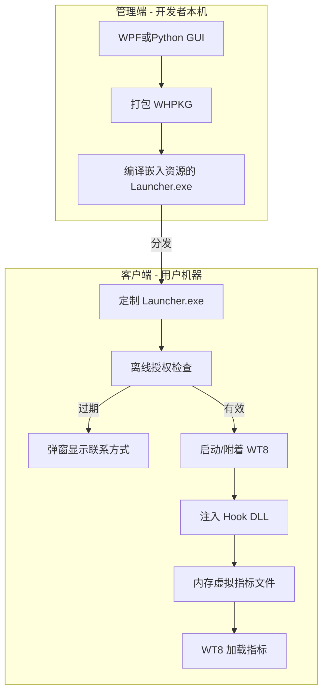
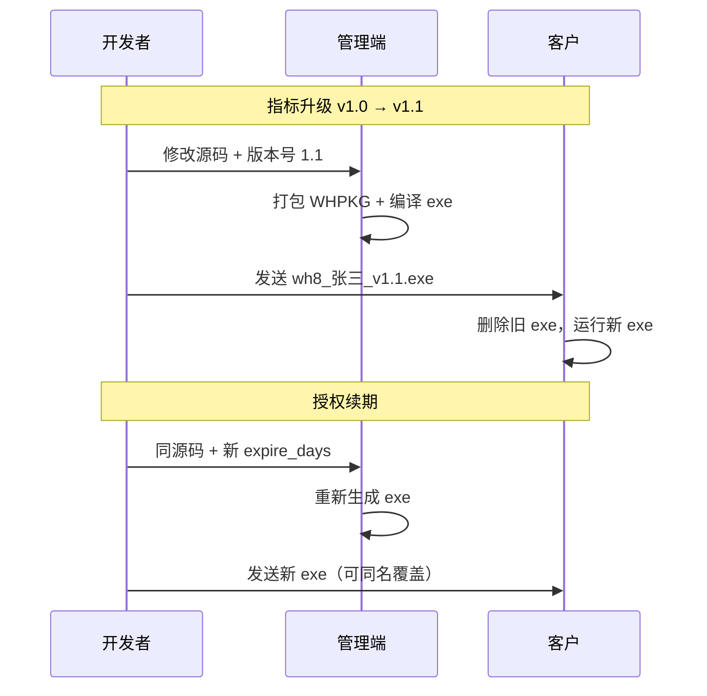

# 文华 WT8 指标加密工具复刻方案

## 与交易星球产品的对照

参考 [交易星球《文华财经指标加密工具》功能概述](https://www.jiaoyixingqiu.com/doc/2441.html)，你的产品定位如下：

| 能力 | 交易星球 | 你的目标 |
|------|----------|----------|
| 源码保护 | 加密 + 客户端分发 | 同等目标 |
| 授权 | 试用天数 + 注册码（一机一码，偏在线管理端） | **纯离线 UTC 到期**，过期弹联系方式 |
| 联网验证 | 有管理端/注册码体系 | **不要**，简化流程 |
| 升级 | 重新发客户端 | **单 exe 模式**：发新版 exe 覆盖旧版 |
| 目标平台 | WH6/WH7 | **WT8/WH8（麦语言）** |
| 操作系统 | WH6/7 时代含 Win7 | **Windows 10 / 11（64 位）** |

相邻目录 [`jiami`](d:\换机\codes\source\jiami) 已有可借鉴的架构（WHPKG 格式、Hook 虚拟文件、Launcher 注入），但按你的选择 **在 `jiami_cursor` 从零重写**，只吸收已验证的设计思路，避免继承其未完成的构建链和 Spike 假设。

---

## 运行环境（Windows 10 / 11）

**支持范围**

| 项目 | 要求 |
|------|------|
| 客户端 Launcher + Hook DLL | **Windows 10（64 位）**、**Windows 11（64 位）** |
| 管理端（WPF） | 同上；开发者本机 Win10/11 均可 |
| WT8/WH8 | 与客户实际安装的 64 位文华版本一致 |
| 架构 | **仅 x64**（与 WT8 x64 安装包对齐，不做 32 位） |

**明确不支持**：Windows 7 / 8 / 8.1（交易星球文档仍有 Win7 网络说明，本项目不覆盖）。

**编译与 API 目标**

- MSVC 编译：`/MACHINE:X64`，链接子系统 `WINDOWS`
- 预处理器：`_WIN32_WINNT=0x0A00`（Windows 10+），不依赖 Win7 专属 API
- Windows SDK：10.0.19041+（Win10/11 通用）
- 应用 manifest：声明 `supportedOS` Win10 + Win11，避免被当作 Win7 程序

**Win10 vs Win11 差异（Phase 0 / Phase 5 双机验证）**

| 差异点 | 说明 |
|--------|------|
| SmartScreen | Win11 默认策略略严，无签名 exe 更常出现「未知发布者」 |
| 核心隔离 / 内存完整性 | 部分 Win11 机器开启后，对跨进程注入更敏感；Spike 时记录开关状态 |
| UAC | 两系统一致；Launcher **不要求管理员**（降低 SmartScreen/杀软敏感度），注入目标为同用户 WT8 进程 |
| 注册表防回拨路径 | `HKCU\Software\WH8Crypto\`，两系统通用 |

Phase 0 Spike 与 Phase 5 验收均需在 **至少一台 Win10 + 一台 Win11** 上跑通全流程。

---

## 安全预期（重要）

**没有任何客户端方案能真正做到「不可破解」**——指标最终必须在 WT8 进程内存中以明文形式存在，熟练的逆向工程师仍可能通过调试/内存 dump 提取。

本方案的目标是 **显著提高破解成本**，使普通用户无法查看源码：

1. **AES-256-GCM** 加密指标正文，密钥派生用 HKDF（与 [`jiami` 的 wh_packet.h](d:\换机\codes\source\jiami\src\cpp\crypto\wh_packet.h) 思路一致）
2. **明文不落盘**：Hook WT8 的文件 API，从内存虚拟返回 `.xtrd` 内容
3. **双层过期校验**：Launcher 启动前 + Hook DLL 注入后各检一次
4. **防时间回拨**：注册表记录 `LastRunUTC`
5. **基础反调试** + 可选后续加壳（VMProtect 等，Phase 6）

向客户宣传时用「高强度加密保护」而非「绝对不可破解」。

---

## 总体架构



**用户操作流程**（对标交易星球「图二客户端」）：

1. 用户双击你发的 `客户名_v1.2.exe`
2. Launcher 检查 UTC 到期 → 过期则弹窗显示你的微信/电话，**不启动 WT8**
3. 有效则启动 WT8（或附着已运行实例），注入 Hook DLL
4. WT8 在指标目录「看到」虚拟加密指标，正常使用，无法通过「查看公式」看到源码

---

## 数据包格式 WHPKG v1

在 `jiami_cursor` 新建格式规范 [`docs/WHPKG.md`](docs/WHPKG.md)，核心布局：

```
[magic:8 "WHPKG\0\1\0"]
[version:4]
[header 明文区]
  product_id=1 (WT8/WH8)
  expire_unix (0=永久)
  user, contact (UTF-8，过期弹窗直接读)
  indicator_version (新增：便于升级时区分版本，如 "2026.06.20")
[nonce:12][tag:16][ciphertext]
  解密后 payload = 麦语言源码 + 备注
```

- **明文 header** 含 `contact`：过期时无需解密即可展示联系方式（现有 jiami 设计正确）
- **密文** 仅含指标源码：真正需要保护的部分
- **主密钥**：每个客户 exe 随机生成 32 字节，编译时嵌入 Launcher + Hook DLL（单 exe 内嵌资源 `RCDATA`）

密钥派生（与 jiami 对齐，三端可互验）：

```
derived_key = HKDF-SHA256(master_key, salt=固定常量, info=product_id|expire|user)
AAD = product_id || expire_unix || user
AES-256-GCM(derived_key, nonce, AAD, plaintext=payload)
```

---

## 项目目录结构（jiami_cursor 从零）

```
jiami_cursor/
├── docs/
│   ├── WHPKG.md              # 格式规范
│   └── WT8_SPIKE.md          # WT8 实测记录（Phase 0 产出）
├── src/
│   ├── crypto/               # C++ 纯实现 SHA/HKDF/AES-GCM + 单元测试
│   ├── hook/                 # MinHook DLL：FindFirst/CreateFile/ReadFile 虚拟文件
│   ├── launcher/             # 启动器：授权/反调试/注入/启动 WT8
│   └── manager/              # 管理端（推荐 C# WPF .NET 4.8，一键生成 exe）
├── tools/
│   └── build_client.py       # CLI：读配置 → 打包 → 编译 → 输出 exe
├── third_party/minhook/      # API Hook 库
└── build/                    # 编译产物、测试指标
```

技术栈：**C++14 x64**（Launcher + Hook + Crypto）+ **C# WPF .NET 4.8** 管理端 + **Python 3** 构建脚本；**仅 Windows 10/11 x64**。

---

## 分阶段实施

### Phase 0：WT8 实测 Spike（阻塞项，必须先做）

在 **Windows 10 与 Windows 11** 各一台、已安装 WT8 的机器上确认（写入 `docs/WT8_SPIKE.md`）：

1. 主进程名：`wt8.exe` / `winwh8.exe` / 其它
2. 麦语言指标目录：如 `...\Formula\TYPES\` 的实际路径
3. 文件后缀：`.xtrd` 或其它
4. WT8 如何发现指标：**目录通配符扫描 `*.xtrd`** 还是指定路径加载
5. `ReadFile` 行为：一次性读完还是分段 + `OVERLAPPED`

Hook 实现强依赖以上结论。jiami 中 [`wh_hook_dll.cpp`](d:\换机\codes\source\jiami\src\cpp\hookdll\wh_hook_dll.cpp) 的 `[SPIKE_CONFIG]` 注释已列出已知风险：`FindFirstFile` 通配符枚举、分段 ReadFile 均未完整实现——Phase 2 必须按 Spike 结果重写。

### Phase 1：加密核心 + 格式（可并行开发）

- 实现 C++ `crypto/` + NIST 测试向量验证
- 实现 Python 参考实现 `tools/wh_pack.py`（管理端/测试用）
- 实现 C# `WhCrypto.cs` / `WhPacket.cs`（管理端调用）
- 交付物：给定 `.myl` 源码 → 输出 `.bin` WHPKG，三端 round-trip 一致

### Phase 2：Hook DLL（内存虚拟文件系统）

基于 Spike 结果实现：

- 共享内存传递：master_key + WHPKG + virtual_dir + virtual_filename
- Hook：`FindFirstFileW`、`FindNextFileW`、`CreateFileW`、`ReadFile`、`GetFileSize(Ex)`、`CloseHandle`
- **per-handle 读偏移**：支持 WT8 分段读取
- **目录枚举插入**：若 WT8 用 `*.xtrd` 扫描，需在真实枚举结果中插入虚拟条目
- 注入后二次校验 `expire_unix`

### Phase 3：Launcher 客户端

- 从 exe `RCDATA` 资源加载 WHPKG + Hook DLL（不落临时明文文件；DLL 可解密后内存加载或写 temp 后立即注入删除）
- 启动流程：
  1. 反调试 / 时间回拨检测
  2. 读 header 明文 → `check_authorization()` → 过期弹窗（含 `contact` + `indicator_version`）
  3. 查找/启动 WT8（常见路径 + 首次文件选择对话框，记住路径到注册表）
  4. CreateRemoteThread 注入 Hook DLL
  5. 可选：托盘提示「指标已加载，到期日 xxx」
- 编译链：`tools/build_client.py` 一键完成 config.h → .rc → cl/link → 输出 `dist/客户_v1.0.exe`

### Phase 4：管理端 GUI

对标交易星球「图一管理端」，WPF 界面字段：

- 指标源码（粘贴/导入 `.myl`）
- 软件名称、联系方式、图标、背景图（写入 Launcher 资源/branding）
- 用户名、试用/授权天数（0=永久）
- 指标版本号（如 `1.2.0`，显示在客户端关于页）
- **加密密钥**（开发者保管，同一密钥可复用以更新同一客户的指标而不改解密逻辑——或每客户独立密钥）
- 按钮：**「生成客户端 exe」** → 内部调用 `build_client.py`，无需用户手动跑 Python

暂不做：注册码、一机一码、在线客户管理（符合你的简化要求）。

### Phase 5：升级/续期工作流（单 exe 模式）



**操作规范**（写入 README）：

- 每次发版：更新 `indicator_version`，文件名建议 `指标名_客户_版本.exe`
- 续期：仅改到期日，重新生成 exe 发给客户
- 客户侧：**替换 exe 即可**，无需联网、无需注册码

### Phase 6：加固（可选，零额外采购成本）

- 主密钥分散存储（XOR 多段 + 运行时拼装）
- 反调试/反 VM：**默认关闭或弱化**（降低杀软启发式评分；需要时可开关）
- **不包含**：商业加壳（VMProtect 等，收费且误报更高）、代码签名证书
- **不做**联网心跳（按你的要求）

---

## 与 jiami 的关系

| 借鉴 | 不继承 |
|------|--------|
| WHPKG 格式思路、Hook 架构、Launcher 注入流程 | 未验证的 Spike 硬编码路径 |
| AES-GCM + HKDF 三端对齐方案 | 断裂的 C# UI（缺 xaml）+ 手动 Python 第二步 |
| MinHook 虚拟文件策略 | build.log 中失败的 MSVC 构建链 |

---

## 杀毒软件误报（高概率，需提前预期）

**结论：会，且概率不低。** 当前方案（Launcher + 跨进程 DLL 注入 + MinHook API Hook + 内嵌加密资源 + 反调试）与恶意软件使用的技术高度重合，杀软启发式引擎很容易报「木马 / 黑客工具 / 注入行为」，即使用途完全合法。

[交易星球官方文档](https://www.jiaoyixingqiu.com/doc/2441.html) 也明确写了：「如果杀毒软件有误报误删请将本加密工具和文华软件安装目录均加入白名单」。说明这是**行业共性**，不是实现细节能完全消除的。

### 为什么会被报

| 行为 | 杀软视角 |
|------|----------|
| `OpenProcess` + `WriteProcessMemory` + `CreateRemoteThread` 注入 DLL | 典型进程注入，与远控/木马同源 |
| MinHook 修改 `kernel32!ReadFile` 等 API | 用户态 Rootkit / 文件隐藏特征 |
| exe 内嵌 DLL + 加密 blob（RCDATA） | 载荷分离、加壳类启发式 |
| 反调试 / 反虚拟机检测 | 恶意软件常用 evasion 手段 |
| Phase 6 商业加壳（VMProtect 等） | **误报率显著上升**，有时比不加壳更糟 |

### 代码签名与成本（按你的要求：零证书成本）

**需要申请/购买吗？** 正规 **Authenticode 代码签名** 必须从 CA（如 Sectigo、DigiCert）购买证书，通常 **约 ¥500–3000/年**（标准证书）；EV 证书更贵且需企业资质。**没有免费且被 Windows/杀软广泛信任的商用签名方案**。

| 方式 | 成本 | 对误报/信任的实际效果 |
|------|------|------------------------|
| 不买证书（未签名 exe） | **¥0** | SmartScreen 提示「未知发布者」；杀软误报概率**更高**，靠用户加白名单 |
| 自签名证书 | ¥0 | **几乎无效**：系统/杀软不信任，SmartScreen 仍报警，不能当商用方案 |
| 商业代码签名证书 | 年费 | 明显降低误报与 SmartScreen 拦截，但仍非零误报 |

**计划调整：不采购证书。** 与 [交易星球](https://www.jiaoyixingqiu.com/doc/2441.html) 一样，把「用户手动添加信任/白名单」作为**正式交付流程的一部分**，而不是可选补救。

### 零成本缓解措施（替代签名）

1. **固定 Launcher/Hook 模板**：所有客户共用同一套编译好的壳，仅内嵌 WHPKG 不同 → 哈希更稳定，有利于免费向微软提交误报申诉（[Microsoft 误报提交](https://www.microsoft.com/en-us/wdsi/filesubmission) **不收费**）。
2. **默认不加壳**：VMProtect 等既收费又加剧误报，Phase 6 商业加壳**不纳入默认方案**。
3. **弱化/可选反调试**：Phase 6 中反 VM、反调试作为可开关项；过度 evasion 会抬高启发式评分。
4. **交付形态**：zip 压缩包 + 《使用说明.pdf》（含加白名单步骤），避免微信/网盘对裸 exe 云查杀。
5. **客户端首次运行引导**：Launcher 内置「若被杀毒拦截，请按以下步骤添加信任」页面（图文/链接到说明）。
6. **免费误报申诉**：向微软、360、火绒提交样本说明用途（无需证书）；申诉通过可减轻 Defender 拦截，但**不能替代**用户本机加白名单。

### 不同环境下的预期（无签名）

- **Windows Defender**：首次运行常见 SmartScreen「Windows 已保护你的电脑」→ 用户需点「更多信息」→「仍要运行」；部分环境直接报 Trojan/Inject。
- **360 / 火绒**：国内用户**更常**需手动添加信任区；应在 Phase 5 实测并写进说明。
- **每个客户单独 exe**：哈希仍可能不同；尽量固定二进制模板，仅改资源段。

### 若无法接受误报：架构备选（保护强度下降）

| 方案 | 误报风险 | 源码保护 |
|------|----------|----------|
| **当前方案**（注入 + 内存 Hook，不落盘明文） | 高 | 强 |
| 加密文件落盘 + 文华「查看密码」+ 客户用 Launcher 仅解密写入 | 中 | 中（磁盘有密文，内存仍可能被 dump） |
| 仅混淆/编译麦语言，无注入 | 低 | 弱（易被还原） |

你已选择强保护路线 + **零签名成本**，**误报与用户手动加白名单是必选项**，与交易星球文档描述一致。Phase 5：**Defender + 360 + 火绒** 实测，产出《用户加白名单说明》。

---

## 风险与缓解

| 风险 | 缓解 |
|------|------|
| WT8 更新改变指标加载方式 | Spike 文档 + 版本适配表；Hook 路径可配置 |
| **杀毒软件误报** | **零证书成本：固定模板 + zip 交付 + 用户白名单说明 + 免费误报申诉；接受 SmartScreen「未知发布者」** |
| 用户改系统时间续期 | UTC 校验 + 注册表 LastRunUTC 防回拨 |
| Win11 内存完整性影响注入 | Spike 记录；文档说明若失败可暂时关闭「内存完整性」或加白名单 |
| 主密钥在 exe 中被提取 | Phase 6 加固；接受「防君子不防高手」边界 |

---

## 验收标准

1. 管理端输入麦语言源码 → 一键生成 `客户.exe`（无需手动命令行）
2. 在 WT8 上：用户可加载并使用指标，**无法查看公式源码**
3. 到期后：WT8 不加载指标，弹窗显示预设联系方式
4. 改系统时间回拨：检测到并拒绝运行
5. 升级：改源码/版本号重新生成 exe，客户替换后正常使用
6. 全程无网络请求
7. **Windows 10 与 Windows 11 各一台**上：WT8 加载指标、过期弹窗、升级替换 exe 均通过
8. 在 Defender / 360 / 火绒下完成误报测试（Win10/Win11 各测），并提供**《用户加白名单说明》**（无证书前提下，验收标准为：按文档操作后客户端可正常运行）
